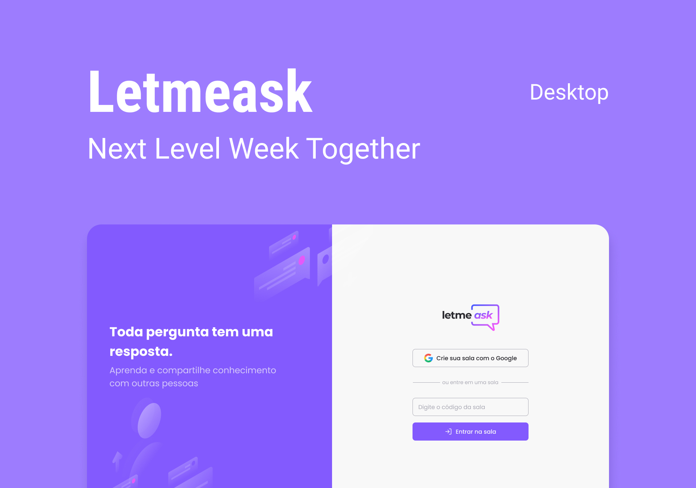

<p align="center">
  

  

  <a href="https://www.linkedin.com/in/rafael-martins-ribeiro/">
    
  </a>

  <a href="https://github.com/RafaelMartinsRibeiro/MoveIt/commits/master">
    
  </a>

  

   <a href="https://github.com/RafaelMartinsRibeiro/LetMeAsk/stargazers">
    
  </a>
</p>


<h1 align="center">
   
</h1>


<p align="center">
    <a href="#-tecnologias">Tecnologias</a>&nbsp;&nbsp;&nbsp;|&nbsp;&nbsp;&nbsp;
    <a href="#-projeto">Projeto</a>&nbsp;&nbsp;&nbsp;|&nbsp;&nbsp;&nbsp;
    <a href="#-features">Features</a>&nbsp;&nbsp;&nbsp;|&nbsp;&nbsp;&nbsp;
    <a href="#-layout">Layout</a>&nbsp;&nbsp;&nbsp;|&nbsp;&nbsp;&nbsp;
    <a href="#-como-contribuir">Como contribuir</a>&nbsp;&nbsp;&nbsp;|&nbsp;&nbsp;&nbsp;
    <a href="#memo-licença">Licença</a>
  </p>

<h1 align="center">
  
</h1>

<h1 align="center">
  
</h1>


## 🚀 Tecnologias

Esse projeto foi desenvolvido com as seguintes tecnologias:

- [Vite](https://vitejs.dev/)
- [TypeScript](https://www.typescriptlang.org)
- [React](https://reactjs.org)
- [Sass](https://sass-lang.com/)
- [Context API](https://pt-br.reactjs.org/docs/context.html)
- [React hooks](https://pt-br.reactjs.org/docs/hooks-intro.html)
- [Firebase](https://firebase.google.com/?hl=pt-br)
- [react-hot-toast](https://react-hot-toast.com/)


## 💻 Projeto

Você pode acessar o projeto através [desse link](https://letmeask-93071.web.app/).

O LetMeAsk consiste em uma aplicação web que tem como finalidade a criação de salas Q&A. O LetMeAsk tem a proposta de resolver problemas de acumulo de perguntas durante uma live, transmissão, etc. Com ela você pode criar salas privadas onde somente os que possuem o ID da sala podem acessar, os participantes podem fazer perguntas(desde que estejam logados com o Google), votar nas mesmas. Já o criador da sala pode demarcar as perguntas como respondidas, colocar foco, dentre outras funcionalidades...


## 🌟 Features

- Como participante
  - [x] Logar com sua conta do google.
  - [x] Criar uma nova sala.
  - [x] Fazer perguntas e enviar.
  - [x] Dar like nas perguntas
  - [x] Botão para copiar o código da sala.
- Como administrador da sala
  - [x] Excluir perguntas.
  - [x] Encerrar salas.
  - [x] Responder perguntas


## 🎨 Layout

Você pode visualizar o layout do projeto através [desse link](https://www.figma.com/community/file/1009824839797878169). É necessário ter conta no [Figma](https://figma.com) para acessá-lo.


## 🤔 Como contribuir

- Faça um fork desse repositório;
- Cria uma branch com a sua feature: `git checkout -b minha-feature`;
- Faça commit das suas alterações: `git commit -m 'feat: Minha nova feature'`;
- Faça push para a sua branch: `git push origin minha-feature`.


### 🧭 Rodando a aplicação

```bash
# Clone este repositório
$ git clone https://github.com/RafaelMartinsRibeiro/LetMeAsk
# Acesse a pasta do projeto no seu terminal/cmd
$ cd LetMeAsk
# Instale as dependências
$ npm install || yarn install
# Siga o passo-a-passo para configurar o firebase (Link abaixo)
# Crie um arquivo .env.local no diretório raiz do projeto
# Copie as variaveis do arquivo .env.example e cole no .env.local, agora preencha as informações com os dados obtidos após configurar o firebase
# Execute a aplicação em modo de desenvolvimento
$ npm run dev || yarn dev
# A aplicação será aberta na porta:3000 - acesse http://localhost:3000
```
[Link Firebase](https://github.com/RafaelMartinsRibeiro/LetMeAsk/tree/master/.github/firebase)


## :memo: Licença

Esse projeto está sob a licença MIT. Veja o arquivo [LICENSE](LICENSE.md) para mais detalhes.

---
